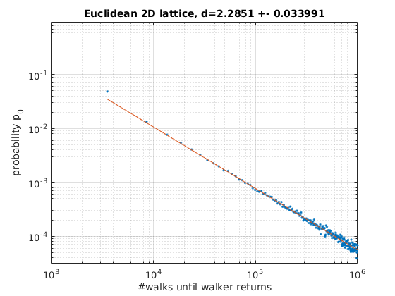
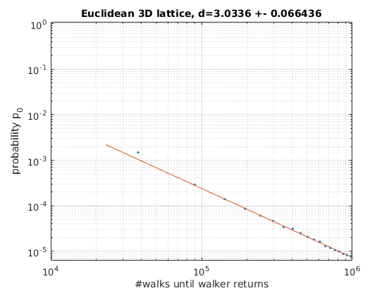
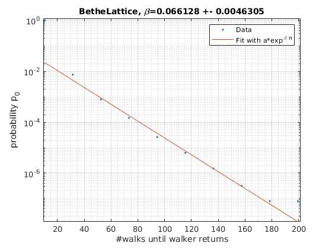

# Calculate spectral dimensions of fractal structures

This project can calculate spectral dimensions of arbitrary fractal structures.
Each fractal structure inherits the class `WalkableGraph`.
This virtual class provides all methods needed to start a multi-core-simulation to calculate the spectral dimension.

The simulation works as follows: Multiple random walkers were spawned at a defined start-point in the `WalkableGraph`.
After that, we let the random walkers move randomly from one neighbour to another.
When a walker comes back to the start-point, we write the number of performed steps to a `.tsv`-file.

We use the mathematical theorem, that  the recurrence-probability `p_0` of a random walk on a graph should follow
for large amount of steps `n`

<code>
p_0=a*n^{d/2}
</code>

where `a` is an arbitrary constant and `d` is the searched spectral dimension.

To create a new fractal structure one has to provide a new class which inherits from `WalkableGraph`.
A constructor for the class has to be written. Furthermore, on has to add the method `hopToNeighbour(unsigned int n)`
which describes to which neighbour a walker can hop from its actual node.
The `unsigned int n` is a random number between 0 and `amountOfNeighbours` specified in the super-constructor.
The used RNG is the MT19937 from `<Random.h>`.

## Installation

### Requirements
1. CMake https://cmake.org/install/
2. Armadillo http://arma.sourceforge.net/download.html
3. Matplotlib-cpp from https://github.com/lava/matplotlib-cpp

### How to compile?
This is a **CMake-Project**. Compilation and building is pretty easy. Simply run in main folder via terminal:

<code>
cmake --build ./cmake-build-release --target Fractal_Dimensions -- -j 6
</code>

The binary is located in `./cmake-build-release/bin/fractals`.

## Simulation results
### 2D Euclidean lattice
In this simulation we observe 8E5 random walkers while walking on a 2D euclidean lattice.
We normalize the resulting histogram of comebacks and draw it in a loglog-scatter-printToConsole against the number of steps.

One observes the following printToConsole:

The expected spectral dimension od a 2D euclidean lattice is 2. But in this simulation we observe 2.29 with a small
statistical error! This is an effect of auto-correlations. These occur because we measure not only the probability
for coming back one time from start-point to start-point, moreover we measure the probability for coming back twice,
three-times and so on. So every next measurement is influenced by its predecessors. This results in awful
auto-correlation-times and as a consequence in large systematical errors.

### 3D Euclidean lattice
In this simulation we observe 4.6E7 random walkers while walking on a 3D euclidean lattice.
We normalize the resulting histogram of comebacks and draw it in a loglog-scatter-printToConsole against the number of steps.

One observes the following printToConsole:

The expected spectral dimension od a 3D euclidean lattice is 3. We can observe this in our simulation because the
systematical errors due to auto-correlations aren't that high. This is a consequence of the lower comeback-rate in 3D.

### Bethe lattice
In this simulation we observe 12.6E6 random walkers while walking on a Bethe-lattice.
A short description what a Bethe-lattice is can be read on Wikipedia.
We normalize the resulting histogram of comebacks and draw it in a semi-log-scatter-printToConsole against the number of steps.

One observes the following printToConsole:

It can be stated that a Bethe-lattice does not satisfy the above law for 'normal' graphs with a power law.
On the contrary, one can see that there is an exponential dependence here with

<code>
p_0=a*\exp^{\beta n}
</code>

One can therefore conclude that the spectral dimension diverges towards infinity.

### Interesting literature:

https://hal.archives-ouvertes.fr/file/index/docid/232136/filename/ajp-jphyslet_1983_44_1_13_0.pdf

https://link.springer.com/content/pdf/10.1007/BF01011791.pdf